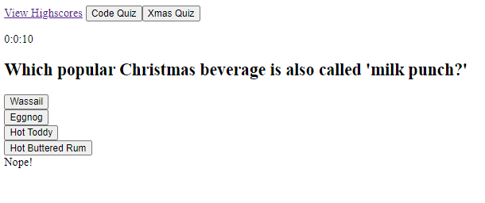
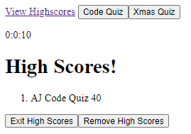

# Quizinator-3000
Bootcamp Module 4 Challenge - Web APIs - Code Quiz

Build your knowledge with the Quizinator 3000: [https://ajureel.github.io/Quizinator-3000/](https://ajureel.github.io/Quizinator-3000/)

This one was tough, building from scratch.

Here are the steps that I followed:

1. Mockup/sketch: I laid out the areas of the screen where content would live
2. Quiz Data: I created an object format for my quiz questions and put them into separate files for easy changes
3. To Do List: I created comments listing all the functionality that needed to be created and then started building one function/section at a time; unit testing as I went

Question Screen Layout with Wrong Answer Result:

High Scores Layout: 

